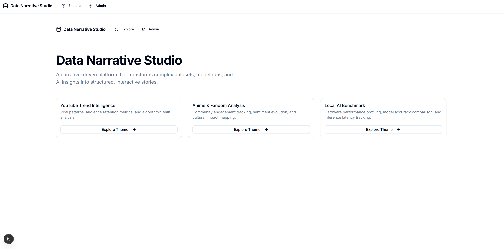

# Data Narrative Studio (數據敘事工坊)



## 專案簡介

**Data Narrative Studio** 是一個以敘事為核心的全棧數據平台，旨在將複雜的數據集、模型執行結果與 AI 洞察轉化為結構化且具備互動性的故事。

本專案結合了現代 Web 技術與數據科學工作流，提供從數據導入、ETL 處理、AI 洞察生成到最終故事呈現的完整流程。

## 核心功能

- 🎨 **敘事故事渲染 (Story Renderer)**: 支援多種區塊（文字、圖表、洞察）的流暢渲染。
- 📊 **多維數據視覺化**: 整合 ECharts 與 Recharts，提供豐富且互動性強的圖表呈現。
- 🔍 **數據集瀏覽器 (Dataset Browser)**: 輕鬆探索、過濾並導出數據。
- 🤖 **AI 洞察整合**: 內置 Python 腳本支持 (ETL, ML, NLP)，自動生成數據趨勢分析。
- 🛠️ **後台管理系統**: 視覺化編輯故事內容，管理數據流水線 (Pipeline)。
- 🌓 **主題切換**: 支持深色與淺色模式，並提供流暢的介面互動。

## 技術棧

- **Frontend**: Next.js 16 (App Router), TypeScript, Tailwind CSS, Framer Motion
- **UI Components**: Shadcn UI, Lucide React
- **Charts**: Apache ECharts, Recharts
- **Backend**: Next.js API Routes, Mongoose (MongoDB)
- **Auth**: NextAuth.js (Auth.js)
- **Data Pipeline**: Python (Scripts for ML/NLP/ETL)

## 快速開始

### 1. 環境變數設定
複製 `.env.example` 並填寫必要的資訊（如 MongoDB URI, NextAuth Secret 等）。

### 2. 安裝依賴
```bash
npm install
```

### 3. 啟動開發伺服器
```bash
npm run dev
```

### 4. 數據初始化 (選填)
若需導入範例數據，請確保已配置 Python 環境：
```bash
# 啟動虛擬環境並執行種子腳本
source venv/bin/activate
python scripts/python/seed_sample_data.py
```

## 專案結構

- `/src/app`: Next.js 頁面與 API 路由。
- `/src/components`: 可複用的 UI 元件與業務邏輯組件。
- `/src/lib`: 數據模型、工具函式及核心邏輯。
- `/scripts`: 包含數據處理、AI 分析等 Python 腳本。

---

*本專案由 Justin21523 維護。*
